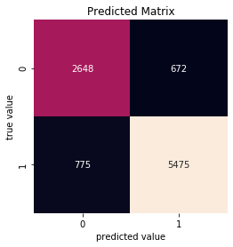
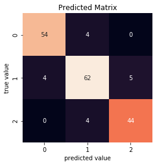
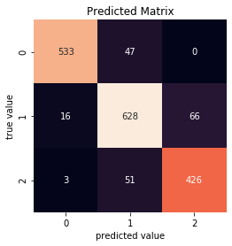

# ID3_decisiontree

In this repository an ID3 decision tree classifier is designed to classify the categorical dataset “Tic-Tac-Toe Endgame” and numerical dataset “Wine” from the UCI Machine Learning Repository. The project is discretized into the following sections:
1. Design of an ID3 decision tree classifier reporting accuracy based on 10-times-10-fold cross validation.
    1. Design an ID3 decision tree classifier using Information Gain for the constrution of the tree for both datasets.
    1. Repeat Part 1 using Gain-Ratio instead of Information Gain. 

1. Analysis of attribute noise and class noise on ID3 decision tree classifier.

## Part 1.1
An ID3 decision tree classifier based on information gain was developed in Python to classify the
datasets “Tic-Tac-Toe Endgame” and “Wine”. The mean and variance of the accuracy based on 10-
times-10-fold cross-validation are reported in Table I. 
TABLE I: ACCURACY RESULTS ID3 INFORMATION GAIN CLASSIFIER TREE 
|   Dataset   |     Criteria     | Accuracy - Mean | Accuracy - STD |
|:-----------:|:----------------:|:---------------:|:--------------:|
| Tic_Tac_Toe | Information Gain |      84.88%     |      3.49      |
|     Wine    | Information Gain |      91.15%     |      7.04      |

The confusion matrix for each dataset is shown in Figure 1 and Figure 2 for the Tic-Tac-Toe and
Wine dataset, respectively. 

  *Figure 1. Confusion matrix generated from Information Gain based ID3 tree for Tic Tac Toe dataset using 10 times 10-fold cross-validation.*  
  *Figure 2. Confusion matrix generated from Information Gain based ID3 tree for Wine dataset using 10 times 10-fold cross-validation.*  

## Part 1.2
Similarly, an ID3 decision tree classifier was developed in Python to classify the datasets “Tic-TacToe Endgame” and “Wine” but was based on Gain Ratio opposed to Information gain. Gain ratio
solves the issue with information gain in which if an attribute has many values, the attribute with
the highest number of values will be selected. The mean and variance of the accuracy based on 10-times-10-fold cross-validation are reported in
Table II. 

TABLE II: ACCURACY RESULTS ID3 INFORMATION GAIN & GAIN RATIO CLASSIFIER TREE 
|   Dataset   |     Criteria     | Accuracy - Mean | Accuracy - STD |
|:-----------:|:----------------:|:---------------:|:--------------:|
| Tic-Tac_Toe | Information Gain |      84.88%     |      3.49      |
| Tic-Tac_Toe |    Gain Ratio    |      86.48%     |      3.35      |
|     Wine    | Information Gain |      91.15%     |      7.038     |
|     Wine    |    Gain Ratio    |      89.78%     |      6.46      |

The confusion matrix for each dataset using gain ratio is shown in Figure 3 and Figure 4 for the Tic-Tac-Toe and
Wine dataset, respectively. 

 *Figure 3. Confusion matrix generated from Gain Ratio based ID3 tree for Tic Tac Toe dataset using 10 times 10-fold cross-validation.*  
*Figure 4. Confusion matrix generated from Gain Ratio based ID3 tree for Wine dataset using 10 times 10-fold cross-validation.*

